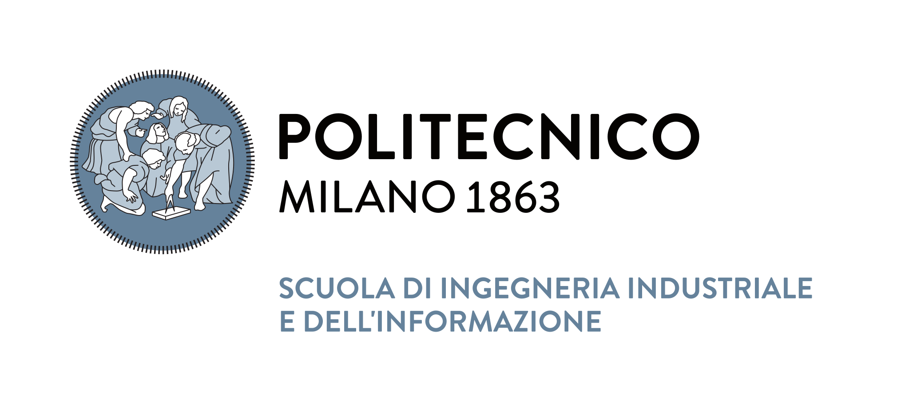

# Calcoli di Processo dell' Ingegneria Chimica

---

This repository contains the materials shown during the practical sessions of the course [Calcoli di
Processo dell' Ingegneria
Chimica](https://www11.ceda.polimi.it/schedaincarico/schedaincarico/controller/scheda_pubblica/SchedaPublic.do?&evn_default=evento&c_classe=764402&polij_device_category=DESKTOP&__pj0=0&__pj1=27c6a939c8ed68d18f61e3b440241503)
taught at Politecnico di Milano by Professor [Marco
Mehl](http://creckmodeling.chem.polimi.it/menu-people/menu-people-faculty/menu-people-marco-mehl).
For the academic years 22-23 and 24-25 I ([Timoteo Dinelli]()) was the teaching assistant.

## Repository organization (A.Y. 24-25)

- [Matlab introduction](https://github.com/tdinelli/Calcoli-di-Processo-dell-Ingegneria-Chimica/tree/main/A.Y.%2024-25/Introduction%20to%20Matlab):
introduction to the usage of matlab, covered topics around variables assignments, loops, conditional
statements, functions, plotting and other basic functionalities for the first 3 lessons ($\sim$ 6
hours).

- [Practical Session 1](https://github.com/tdinelli/Calcoli-di-Processo-dell-Ingegneria-Chimica/tree/main/A.Y.%2024-25/Practical%20Session%201):
Numbers representation, numerical errors and approximations, rounding ($\sim$ 2 hours).

- [Practical Session 2](https://github.com/tdinelli/Calcoli-di-Processo-dell-Ingegneria-Chimica/tree/main/A.Y.%2024-25/Practical%20Session%202):
Linear systems of equations Part 1 ($\sim$ 2 hours).

- [Practical Session 3](https://github.com/tdinelli/Calcoli-di-Processo-dell-Ingegneria-Chimica/tree/main/A.Y.%2024-25/Practical%20Session%203):
Linear systems of equations Part 2 ($\sim$ 2 hours).

- [Practical Session 4](https://github.com/tdinelli/Calcoli-di-Processo-dell-Ingegneria-Chimica/tree/main/A.Y.%2024-25/Practical%20Session%204):
Root finding Part 1 ($\sim$ 2 hours).

- [Practical Session 5](https://github.com/tdinelli/Calcoli-di-Processo-dell-Ingegneria-Chimica/tree/main/A.Y.%2024-25/Practical%20Session%205):
Root finding Part 2 ($\sim$ 2 hours).

- [Practical Session 6](https://github.com/tdinelli/Calcoli-di-Processo-dell-Ingegneria-Chimica/tree/main/A.Y.%2024-25/Practical%20Session%206):
Final exam simulation ($\sim$ 2 hours).

- [Practical Session 7](https://github.com/tdinelli/Calcoli-di-Processo-dell-Ingegneria-Chimica/tree/main/A.Y.%2024-25/Practical%20Session%207):
Numerical Integration ($\sim$ 2 hours).

- [Practical Session 8](https://github.com/tdinelli/Calcoli-di-Processo-dell-Ingegneria-Chimica/tree/main/A.Y.%2024-25/Practical%20Session%208):
Ordinary Differential Equations Part 1 ($\sim$ 2 hours).

- [Practical Session 9](https://github.com/tdinelli/Calcoli-di-Processo-dell-Ingegneria-Chimica/tree/main/A.Y.%2024-25/Practical%20Session%209):
Ordinary Differential Equations Part 2 ($\sim$ 2 hours).
